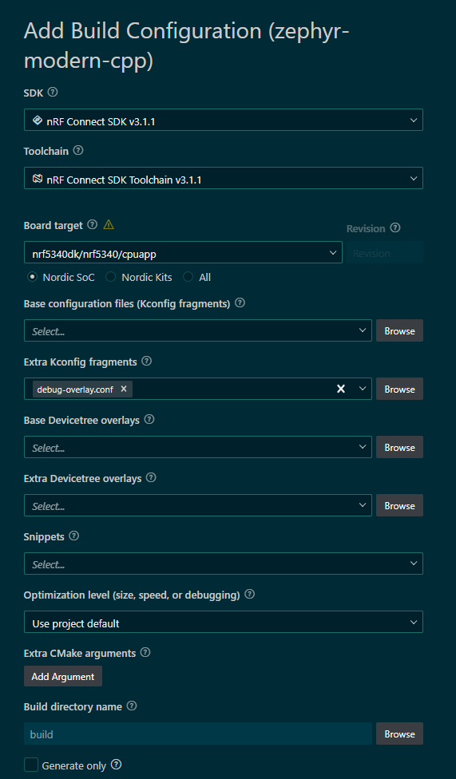

# Zephyr C++23 Modern Practices Project

A Zephyr RTOS example repository demonstrating what is *practical and achievable* with **C++23** in a real embedded environment, focusing on type safety, zero-allocation patterns, and modern language features that integrate cleanly with Zephyr’s kernel and tooling.

## Project Overview

This project showcases a **C++23-based state machine and sensor processing system** running on **Zephyr RTOS**, designed to illustrate how modern C++ can be used effectively without compromising determinism, memory usage, or real-time behavior.

The code intentionally avoids dynamic allocation, exceptions, and RTTI, and instead emphasizes **compile-time guarantees**, **static storage**, and **clear ownership models** suitable for embedded systems.

**Primary goal:** demonstrate how far modern C++23 can be pushed on Zephyr today, and which language/library features are realistic for production embedded firmware.

## Key C++23 Features Demonstrated

### Language Features

* **Concepts & Constraints** (`concept SensorType`)
  Compile-time enforcement of sensor interfaces without inheritance.
* **Abbreviated Function Templates** (`auto` parameters)
  Cleaner, more readable generic code.
* **`std::variant` + `std::visit`**
  Type-safe finite state machine implementation without base classes.
* **Generic Lambdas with Template Parameters**
  Used for variant visitation with zero runtime overhead.
* **`if` with Initializer**
  Scope-limited state checks.
* **Structured Bindings**
  Clean decomposition of tuples.
* **Attributes** (`[[nodiscard]]`, `[[maybe_unused]]`)
  Improved correctness and intent signaling.

### Standard Library Features

* **`std::span`**
  Safe, non-owning views over static buffers and sensor data.
* **`std::array`**
  Fixed-size, allocation-free containers.
* **`std::chrono` literals** (`2000ms`, `5s`)
  Readable, type-safe timing.
* **`std::tuple`**
  Lightweight aggregation for statistics.
* **`std::string_view`**
  Zero-allocation string handling.

### Zephyr Integration

* **Zephyr kernel threads (`k_thread_create`)**
* **Cooperative thread priorities**
* **Zephyr logging subsystem (`LOG_INF`, `LOG_WRN`)**
* **Zephyr timing (`k_msleep`)**
* **Thread naming and identification**
* **Static thread stacks and deterministic memory usage**

## Example Breakdown

### `zephyr_span_visit_concept.cpp` — Modern C++23 State Machine

A complete, self-contained example demonstrating:

* Variant-based finite state machine (`Idle`, `Monitoring`, `Alert`, `Calibrating`)
* State transitions implemented via `std::visit`
* Concept-constrained sensor processing (`Temperature`, `Humidity`, `Pressure`)
* Sensor aggregation using parameter packs and `std::span`
* Rolling sensor buffer with min/max statistics
* Multiple Zephyr threads interacting with independent state machine managers
* Logging-friendly state introspection without heap allocation

This file is intentionally dense and representative of *real firmware*, not toy examples.

## Design Principles

### Memory Discipline

* No dynamic allocation (`new`, `delete`, `std::vector`)
* Fixed-size buffers with `std::array`
* Views via `std::span`
* Static storage where appropriate

### Type Safety

* No base classes or virtual dispatch
* No runtime type checks
* Compile-time validation with concepts
* Exhaustive state handling enforced by `std::variant`

### Concurrency Awareness

* Multiple cooperative threads
* Explicit stack sizing
* No shared mutable global state
* Thread-local managers

### Embedded Realism

* Logging instead of exceptions
* Deterministic control flow
* Explicit timing and scheduling
* Compatibility with Zephyr’s kernel model

## Build Configuration

Typical Zephyr configuration (snippet):

```cmake
target_compile_options(app PRIVATE -std=gnu++23)
```

**Compiler Requirements**

* GCC 13+ (or equivalent with C++23 support)
* Zephyr toolchain with `gnu++23` enabled

## Project Structure

```
src/
├── main.cpp   # C++23 state machine and sensor example
```

## Usage

The application creates:

* Two state-monitoring threads
* One sensor-processing thread
* A main control thread

Each periodically:

* Reads sensors
* Updates state machines
* Logs state transitions and buffer statistics

This provides a live demonstration of modern C++ constructs operating under Zephyr’s scheduler.

## Best Practices Demonstrated

1. **Modern C++ without dynamic allocation**
2. **Variant-based state machines instead of inheritance**
3. **Concepts for interface enforcement**
4. **Safe buffer access via `std::span`**
5. **Chrono-based timing instead of raw integers**
6. **Clear separation between platform code and business logic**

## Build Configuration
